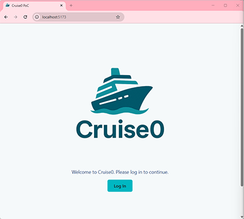

### **Cruise0 Auth0 Integration Proof of Concept**

This Proof of Concept was prepared for Cruise0 to demonstrate how Okta, using the Auth0 identity platform, can support app modernization using ReactJS. It shows how Auth0 can power secure login, account management, and identity workflows for a modern web application.

#### **Key Features:**

* Universal Login with Cruise0 branding 
* Google and email/password login support
* Email verification enforcement using a Post-Login Action
* Account linking for users with duplicate identities
* Lightweight frontend built with React and Vite

#### **To run this app locally:**

1. **Clone the repository:**  
`git clone https://github.com/jeremytoadslime/cruise0-PoC.git`  
`cd cruise0-PoC`

1. **Install dependencies:**  
`npm install`

1. **In the root of the project, make a copy of the `.env.example` file and name it `.env`. Replace the placeholder values with the appropriate Auth0 configuration for your tenant:**  
`VITE_AUTH0_DOMAIN=your-tenant.us.auth0.com`  
`VITE_AUTH0_CLIENT_ID=your-client-id`  
`VITE_AUTH0_CALLBACK_URL=http://localhost:5173`
  
    *Note: Port 5173 is the default for Vite development servers. If you run the app on a different port, be sure to update both the `VITE_AUTH0_CALLBACK_URL` in your `.env` file and the corresponding allowed URLs in your Auth0 application settings.*

1. **Start the app:**  
`npm run dev`

    This will launch the app at [http://localhost:5173](http://localhost:5173)

#### Auth0 Configuration Notes:

* This app is registered in your Auth0 tenant as a "Single Page Application"
* Both the Google and Username-Password login methods are enabled
* The following URLs must be configured in the Auth0 **Application Settings** dashboard:  
    Allowed Callback URL: http://localhost:5173  
    Allowed Logout URL: http://localhost:5173  
    Allowed Web Origins: http://localhost:5173  

#### Additional Setup Required in Auth0:

* Create a **Post-Login Action** using the **"Confirm Email is Verified"** template  
        See: https://auth0.com/docs/manage-users/user-accounts/verify-emails
* Install and configure the **Account Linking Extension** from the Auth0 Marketplace  
        See: https://auth0.com/docs/customize/extensions/account-link-extension

#### Known Limitations:

* Resending the verification email must currently be done via the Auth0 dashboard or Management API
* The app does not include a backend service
* Only designed for local deployment
